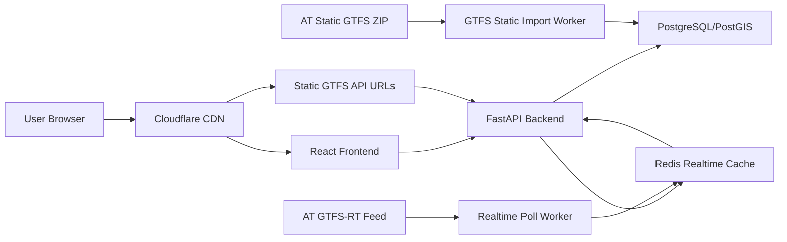

# Auckland Transport Public Note: Project Specification

## 1. Purpose

This document specifies a new public transport web application for Auckland, New Zealand. The application helps authenticated users discover routes, find nearby stops, save favourite routes, view route geometry on a map, and monitor realtime vehicle positions, trip updates, and service alerts.

The core design decision is to separate static GTFS data from realtime GTFS-RT data. Static GTFS-derived resources are exposed through deterministic, versioned URLs that can be cached by Cloudflare at the edge. Realtime data is kept short-lived and served from Redis-backed API endpoints and Server-Sent Events.

The API must use clean, predictable request parameters. It must avoid endpoints that combine unrelated concerns such as route geometry, nearby search, departures, vehicles, trip updates, and alerts in one response.

## 2. Product Goals

| ID | Goal | Description |
| --- | --- | --- |
| PG-01 | Route discovery | Users can browse, search, and select Auckland public transport routes. |
| PG-02 | Nearby discovery | Users can find nearby stops and routes using request-scoped geolocation. |
| PG-03 | Map display | Users can view route shapes, stop sequences, and selected realtime vehicles on a map. |
| PG-04 | Realtime awareness | Users can view live vehicles, trip updates, departures, and service alerts. |
| PG-05 | User preferences | Users can save and reload favourite routes. |
| PG-06 | Static CDN caching | Static GTFS-derived resources are cacheable through Cloudflare using versioned URLs and HTTP cache headers. |
| PG-07 | Clean API contracts | Request parameters are grouped by domain: static GTFS, spatial discovery, timetable, realtime, and user preferences. |

## 3. Users

| User type | Needs |
| --- | --- |
| Commuter | Quickly find favourite routes, nearby stops, live vehicles, and expected departures. |
| Visitor | Search unfamiliar routes and understand route paths on a map. |
| Mobile user | Use the app on low-bandwidth mobile networks with minimal repeated static-data downloads. |
| Maintainer | Operate GTFS imports, realtime polling, deployments, cache invalidation, and monitoring. |

## 4. Scope

### 4.1 In Scope

- User registration and login.
- JWT bearer token authentication.
- Route list, route detail, and route search.
- Static route shapes derived from GTFS `trips.shape_id` and `shapes.txt`.
- Static route stop sequences derived from representative GTFS trips.
- Static stop detail and batch stop lookup.
- Nearby stop and nearby route discovery using PostGIS spatial queries.
- Scheduled departures and trip stop sequences from static GTFS.
- Realtime vehicles, trip updates, and alerts from GTFS-RT.
- Server-Sent Events for live realtime refresh notifications.
- Favourite route storage per user.
- Cloudflare caching for static GTFS-derived JSON resources.
- Docker-based deployment.
- Backend and frontend automated tests.

### 4.2 Out of Scope

- Ticketing, fare payment, or journey purchase.
- Long-term user location tracking.
- Native mobile applications.
- Operator/admin UI for editing transit data.
- Machine-learning arrival prediction beyond GTFS schedule and GTFS-RT delay data.

## 5. Architecture

### 5.1 Component View



### 5.2 Technology Stack

| Layer | Technology | Purpose |
| --- | --- | --- |
| Frontend | React, Vite, TypeScript | Responsive single-page web application |
| Map UI | MapLibre GL | Auckland map, route lines, stop and vehicle markers |
| Backend | FastAPI, Uvicorn | REST API, auth, static resource API, realtime API, SSE |
| Database | PostgreSQL with PostGIS | GTFS relational data and spatial queries |
| Database access | psycopg connection pool and explicit SQL | Database queries, schema creation, and bulk GTFS import |
| Realtime cache | Redis | Short-lived GTFS-RT vehicle, trip update, and alert cache |
| Edge cache | Cloudflare | Static GTFS-derived JSON URL caching |
| HTTP client | HTTPX | AT feed polling |
| Deployment | Docker Compose, Nginx | Service orchestration and frontend static-file serving |
| Testing | Pytest, TypeScript compiler | Backend automated tests and frontend type checking |

## 6. Data Sources

| Source | Type | Usage |
| --- | --- | --- |
| Auckland Transport static GTFS ZIP | Static GTFS | Routes, stops, trips, stop times, calendar, shapes |
| Auckland Transport GTFS-RT feed | Realtime GTFS-RT | Vehicles, trip updates, alerts |
| OpenStreetMap tiles/provider | Map display | Base map rendering through MapLibre |

## 7. Data Storage

### 7.1 PostgreSQL/PostGIS Tables

| Table | Purpose |
| --- | --- |
| `users` | User account, email, password hash |
| `user_favourite_routes` | User saved route IDs |
| `gtfs_feed_versions` | Imported static feed metadata and active feed version |
| `routes` | GTFS routes |
| `stops` | GTFS stops with PostGIS point geometry |
| `trips` | GTFS trips, including `route_id`, `direction_id`, and `shape_id` |
| `stop_times` | GTFS stop sequence and scheduled arrival/departure times |
| `calendar` | GTFS service calendar |
| `calendar_dates` | GTFS service exceptions |
| `shapes` | Aggregated PostGIS line geometry for each `shape_id` |
| `shape_points` | Raw ordered GTFS shape points |

### 7.2 Redis Data

Redis is only used for realtime or operationally short-lived data. Static GTFS JSON resources are not cached in Redis.

| Redis key | Purpose | TTL |
| --- | --- | --- |
| `gtfsrt:vehicles` | Hash of normalized vehicle positions | Refreshed each poll |
| `gtfsrt:trip_updates` | Hash of normalized trip updates by trip ID | Refreshed each poll |
| `gtfsrt:alerts` | Hash of normalized alerts by alert ID | Refreshed each poll |
| `gtfsrt:channel` | Pub/sub channel for SSE refresh events | No TTL |
| `spatial:nearby_stops:{feed_version}:{cell}:{radius_m}:{limit}` | Nearby stops for a coarse location cell | 5-30 minutes |
| `spatial:nearby_routes:{feed_version}:{cell}:{radius_m}:{limit}:{route_type_hash}` | Nearby routes for a coarse location cell and route filter | 5-30 minutes |
| `jobs:static_import:{job_id}` | Optional import job state | 24 hours |

Spatial cache keys must use a coarse cell ID such as H3, S2, or rounded geohash. They must not include raw latitude, raw longitude, user ID, email, IP address, or bearer token.

### 7.3 Cloudflare Static Cache

Cloudflare caches deterministic static GTFS API URLs. The backend remains the origin and PostGIS remains the source of truth.

Static URLs must include a feed version identifier where possible:

```text
/api/static/v1/feeds/{feed_version}/routes
/api/static/v1/feeds/{feed_version}/routes/{route_id}
/api/static/v1/feeds/{feed_version}/routes/{route_id}/shapes
/api/static/v1/feeds/{feed_version}/trips/{trip_id}/shape
/api/static/v1/feeds/{feed_version}/stops/{stop_id}
```

When a new static GTFS feed is imported, new versioned URLs are created automatically. Old versioned URLs may remain cached until their TTL expires. The active feed pointer endpoint has a shorter TTL.

## 8. Cache Strategy

### 8.1 Static Resources

Static GTFS-derived resources are cacheable because they change only when a new static feed is imported.

| Resource type | URL style | Cache policy |
| --- | --- | --- |
| Active feed metadata | `/api/static/v1/feed` | `max-age=60, stale-while-revalidate=300` |
| Versioned feed metadata | `/api/static/v1/feeds/{feed_version}` | `max-age=86400, immutable` |
| Route list | `/api/static/v1/feeds/{feed_version}/routes` | `max-age=86400, immutable` |
| Route detail | `/api/static/v1/feeds/{feed_version}/routes/{route_id}` | `max-age=86400, immutable` |
| Route shapes | `/api/static/v1/feeds/{feed_version}/routes/{route_id}/shapes` | `max-age=86400, immutable` |
| Trip shape | `/api/static/v1/feeds/{feed_version}/trips/{trip_id}/shape` | `max-age=86400, immutable` |
| Stop detail | `/api/static/v1/feeds/{feed_version}/stops/{stop_id}` | `max-age=86400, immutable` |

Recommended headers for versioned static URLs:

```http
Cache-Control: public, max-age=86400, immutable
ETag: "sha256-of-response"
X-GTFS-Feed-Version: 2026-07-10T020000Z-a7f3
Content-Type: application/json
```

Recommended headers for active pointer URLs:

```http
Cache-Control: public, max-age=60, stale-while-revalidate=300
ETag: "active-feed-sha"
Content-Type: application/json
```

### 8.2 Cloudflare Rules

Cloudflare should cache API responses only for static paths:

```text
Cache eligible:
/api/static/*

Cache bypass:
/api/auth/*
/api/app/*
/api/realtime/*
/api/discovery/*
/api/timetable/*
```

Cloudflare cache key should include:

- Full path.
- Query string for static filters such as `direction_id`, route type, search, and pagination.
- `Accept-Encoding`.

Cloudflare cache key should not include:

- `Authorization` for public static resources.
- Cookies.
- User-agent.

### 8.3 Cache Invalidation

Preferred strategy:

1. Import new GTFS feed into the database.
2. Generate a new `feed_version` string from import timestamp and feed SHA.
3. Mark the new feed as active.
4. Let the short cache TTL on the active pointer expire. An operator may optionally
   purge `/api/static/v1/feed` when immediate propagation is required.

Versioned static URLs do not need purge because new feed versions produce new URLs.

### 8.4 Spatial Query Cache

Nearby stop and nearby route discovery can be CPU-heavy because spatial distance ordering is calculated in the database. These endpoints are not suitable for Cloudflare public caching because they use user location and authentication. Instead, use a privacy-safe server-side Redis cache based on coarse location cells.

Recommended approach:

1. Convert the request latitude/longitude into a coarse spatial cell.
2. Build a cache key from `feed_version`, cell ID, radius, limit, and normalized route filters.
3. Check Redis before querying PostGIS.
4. On cache miss, query PostGIS using spatial indexes.
5. Store only the result list and cache metadata in Redis.
6. Never store the raw coordinate or user identity in the cache value.

Example key:

```text
spatial:nearby_stops:2026-07-10T020000Z-a7f3:h3_872830828ffffff:800:20
```

Example cached value:

```json
{
  "feed_version": "2026-07-10T020000Z-a7f3",
  "cell": "h3_872830828ffffff",
  "radius_m": 800,
  "limit": 20,
  "generated_at": "2026-07-10T09:30:00+12:00",
  "items": [
    {
      "stop_id": "stop-001",
      "stop_name": "Britomart",
      "stop_lat": -36.8441,
      "stop_lon": 174.7679,
      "distance_m": 180
    }
  ]
}
```

The `distance_m` value may be calculated from the original request coordinate before storing the response. Because the cached response is shared by a coarse cell, small distance differences are acceptable for nearby discovery. If exact distance is required, the API can cache candidate stop IDs by cell, then recalculate exact distances per request from the raw coordinate without repeating the expensive broad spatial search.

Recommended TTL:

| Cache | TTL | Reason |
| --- | --- | --- |
| Nearby stops by cell | 5-30 minutes | Stops rarely change, but short TTL avoids stale active-feed issues. |
| Nearby routes by cell | 5-30 minutes | Routes depend on the active feed and optional route filters. |
| Candidate stop IDs by cell | 1-24 hours | Safe when keyed by `feed_version`; exact distances can be recalculated per request. |

Spatial cache invalidation:

- Include `feed_version` in every spatial cache key.
- When a new feed becomes active, new requests naturally use new keys.
- Old spatial keys expire by TTL and do not require manual purge.

## 9. API Design Principles

1. Static GTFS endpoints are public and Cloudflare-cacheable.
2. Authenticated user endpoints are private and never cached by Cloudflare.
3. Realtime endpoints are authenticated, short-lived, and backed by Redis.
4. Static resources must not include realtime vehicles, trip updates, or alerts.
5. Realtime resources must not include route shapes or full static stop sequences.
6. Parameters must be grouped by concern and named consistently.
7. Arrays must use repeated query parameters for GET or JSON arrays for POST.
8. Avoid comma-combined string parameters.
9. POST request bodies should be used for complex filters or large ID lists.
10. User coordinates are request-scoped and must not be stored with user identity.

## 10. Parameter Model

### 10.1 Shared Parameter Groups

| Group | Fields | Usage |
| --- | --- | --- |
| `RouteFilter` | `route_ids`, `route_types`, `search`, `direction_id`, `include_inactive` | Route search, route-related realtime filters |
| `StopFilter` | `stop_ids`, `parent_station_ids`, `route_ids` | Stop lookup, departures |
| `TripFilter` | `trip_ids`, `route_ids`, `direction_id`, `service_date` | Trip lookup and trip-specific realtime |
| `SpatialQuery` | `lat`, `lon`, `radius_m`, `limit` | Nearby stops and nearby routes |
| `ServiceDateFilter` | `service_date`, `timezone` | Timetable requests |
| `TimeWindow` | `from_time`, `to_time`, `max_results` | Departure windows |
| `RealtimeFilter` | `route_ids`, `trip_ids`, `vehicle_ids`, `stop_ids`, `event_types` | Vehicle, trip update, alert, and SSE filters |

### 10.2 JSON Request Examples

Nearby route request:

```json
{
  "spatial": {
    "lat": -36.8485,
    "lon": 174.7633,
    "radius_m": 800,
    "limit": 20
  },
  "route_filter": {
    "route_types": [3]
  }
}
```

Departure request:

```json
{
  "stop_filter": {
    "stop_ids": ["stop-001"],
    "route_ids": ["NX1-202"]
  },
  "service_date": {
    "service_date": "2026-07-10",
    "timezone": "Pacific/Auckland"
  },
  "time_window": {
    "from_time": "08:00:00",
    "to_time": "10:00:00",
    "max_results": 10
  }
}
```

Realtime vehicle request:

```json
{
  "realtime_filter": {
    "route_ids": ["NX1-202"],
    "trip_ids": []
  }
}
```

## 11. API Specification

### 11.1 API Namespaces

| Namespace | Cache | Auth | Purpose |
| --- | --- | --- | --- |
| `/api/auth/v1` | No store | Mixed | Register, login, current user |
| `/api/static/v1` | Cloudflare public cache | No | Static GTFS-derived resources |
| `/api/discovery/v1` | No store | Yes | Nearby stops/routes using user location |
| `/api/timetable/v1` | No store or private short TTL | Yes | Scheduled departures and trip stop times |
| `/api/realtime/v1` | No store | Yes | Vehicles, trip updates, alerts, SSE |
| `/api/app/v1` | No store | Yes | User favourites and app preferences |

## 12. Authentication API

### POST `/api/auth/v1/register`

Registers a user and returns an access token.

Request:

```json
{
  "email": "user@example.com",
  "password": "secure-password"
}
```

Response:

```json
{
  "access_token": "jwt-token",
  "token_type": "bearer",
  "user": {
    "id": 1,
    "email": "user@example.com"
  }
}
```

### POST `/api/auth/v1/login`

Authenticates a user.

Request:

```json
{
  "email": "user@example.com",
  "password": "secure-password"
}
```

Response:

```json
{
  "access_token": "jwt-token",
  "token_type": "bearer",
  "user": {
    "id": 1,
    "email": "user@example.com"
  }
}
```

### GET `/api/auth/v1/me`

Returns the authenticated user profile.

Response:

```json
{
  "id": 1,
  "email": "user@example.com"
}
```

## 13. Static GTFS API

Static GTFS APIs are public and designed for Cloudflare caching. These endpoints must not depend on user identity.

### GET `/api/static/v1/feed`

Returns the currently active static feed pointer.

Response:

```json
{
  "feed_version": "2026-07-10T020000Z-a7f3",
  "sha256": "a7f3...",
  "imported_at": "2026-07-10T02:00:00Z",
  "urls": {
    "routes": "/api/static/v1/feeds/2026-07-10T020000Z-a7f3/routes",
    "metadata": "/api/static/v1/feeds/2026-07-10T020000Z-a7f3"
  }
}
```

### GET `/api/static/v1/feeds/{feed_version}`

Returns metadata and entity counts for a specific static feed version.

Response:

```json
{
  "feed_version": "2026-07-10T020000Z-a7f3",
  "source_url": "https://example.com/gtfs.zip",
  "sha256": "a7f3...",
  "etag": "\"source-etag\"",
  "last_modified": "Fri, 10 Jul 2026 02:00:00 GMT",
  "imported_at": "2026-07-10T02:00:00Z",
  "counts": {
    "routes": 520,
    "stops": 6120,
    "trips": 93000,
    "shapes": 14000,
    "stop_times": 2800000
  }
}
```

### GET `/api/static/v1/feeds/{feed_version}/routes`

Returns route summaries.

Query parameters:

| Parameter | Type | Required | Description |
| --- | --- | --- | --- |
| `search` | string | No | Search route short name or long name |
| `route_type` | integer repeated | No | GTFS route type filter |
| `limit` | integer | No | Default 100, max 500 |
| `offset` | integer | No | Default 0 |

Response:

```json
{
  "feed_version": "2026-07-10T020000Z-a7f3",
  "items": [
    {
      "route_id": "NX1-202",
      "route_short_name": "NX1",
      "route_long_name": "Hibiscus Coast Station to City Centre",
      "route_type": 3,
      "route_color": "00AEEF",
      "route_text_color": "FFFFFF",
      "route_sort_order": 10
    }
  ],
  "page": {
    "limit": 100,
    "offset": 0,
    "total": 520
  }
}
```

### GET `/api/static/v1/feeds/{feed_version}/routes/{route_id}`

Returns route detail and available directions.

Response:

```json
{
  "feed_version": "2026-07-10T020000Z-a7f3",
  "route": {
    "route_id": "NX1-202",
    "route_short_name": "NX1",
    "route_long_name": "Hibiscus Coast Station to City Centre",
    "route_type": 3,
    "route_color": "00AEEF",
    "route_text_color": "FFFFFF"
  },
  "directions": [
    {
      "direction_id": 0,
      "headsigns": ["City Centre"]
    },
    {
      "direction_id": 1,
      "headsigns": ["Hibiscus Coast Station"]
    }
  ]
}
```

### GET `/api/static/v1/feeds/{feed_version}/routes/{route_id}/shapes`

Returns deduplicated shapes used by trips on the route. In GTFS, geometry belongs to trips through `trips.shape_id`; this endpoint is a route-level convenience view that joins `routes -> trips -> shapes`, groups duplicate `shape_id` values, and returns the distinct shape geometries needed to draw the route.

Query parameters:

| Parameter | Type | Required | Description |
| --- | --- | --- | --- |
| `direction_id` | integer | No | Filter trips by direction |

Route shapes are returned as GeoJSON. Geometry format conversion and server-side
simplification are outside the current API contract.

Response:

```json
{
  "feed_version": "2026-07-10T020000Z-a7f3",
  "route_id": "NX1-202",
  "items": [
    {
      "shape_id": "shape-001",
      "direction_id": 0,
      "representative_trip_id": "trip-001",
      "trip_headsign": "City Centre",
      "point_count": 120,
      "geometry": {
        "type": "LineString",
        "coordinates": [[174.7633, -36.8485]]
      }
    }
  ]
}
```

### GET `/api/static/v1/feeds/{feed_version}/trips/{trip_id}/shape`

Returns the exact shape referenced by one trip.

Response:

```json
{
  "feed_version": "2026-07-10T020000Z-a7f3",
  "trip_id": "trip-001",
  "route_id": "NX1-202",
  "direction_id": 0,
  "shape_id": "shape-001",
  "geometry": {
    "type": "LineString",
    "coordinates": [[174.7633, -36.8485]]
  }
}
```

### GET `/api/static/v1/feeds/{feed_version}/routes/{route_id}/stops`

Returns representative ordered stop sequences for a route. Since GTFS stop sequences belong to trips, this endpoint must identify representative trips per direction and return their ordered stops.

Query parameters:

| Parameter | Type | Required | Description |
| --- | --- | --- | --- |
| `direction_id` | integer | No | Direction filter |
| `trip_id` | string | No | If provided, return the sequence for this exact trip |

Response:

```json
{
  "feed_version": "2026-07-10T020000Z-a7f3",
  "route_id": "NX1-202",
  "directions": [
    {
      "direction_id": 0,
      "representative_trip_id": "trip-001",
      "stops": [
        {
          "stop_id": "stop-001",
          "stop_sequence": 1,
          "stop_name": "Britomart",
          "stop_lat": -36.8441,
          "stop_lon": 174.7679,
          "platform_code": "A"
        }
      ]
    }
  ]
}
```

### GET `/api/static/v1/feeds/{feed_version}/trips/{trip_id}/stops`

Returns the exact ordered stop sequence for one trip.

Response:

```json
{
  "feed_version": "2026-07-10T020000Z-a7f3",
  "trip_id": "trip-001",
  "route_id": "NX1-202",
  "direction_id": 0,
  "stops": [
    {
      "stop_id": "stop-001",
      "stop_sequence": 1,
      "arrival_time": "08:14:00",
      "departure_time": "08:15:00",
      "stop_name": "Britomart",
      "stop_lat": -36.8441,
      "stop_lon": 174.7679
    }
  ]
}
```

### GET `/api/static/v1/feeds/{feed_version}/stops/{stop_id}`

Returns static stop detail.

Response:

```json
{
  "feed_version": "2026-07-10T020000Z-a7f3",
  "stop": {
    "stop_id": "stop-001",
    "stop_code": "1234",
    "stop_name": "Britomart",
    "stop_lat": -36.8441,
    "stop_lon": 174.7679,
    "platform_code": "A",
    "parent_station": null,
    "wheelchair_boarding": 1
  }
}
```

### POST `/api/static/v1/feeds/{feed_version}/stops/batch`

Returns static details for multiple stops. This endpoint is static-data only, but because POST responses are less reliably cached by CDNs, the frontend should prefer individual GET stop URLs when Cloudflare caching is important.

Request:

```json
{
  "stop_filter": {
    "stop_ids": ["stop-001", "stop-002"]
  }
}
```

Response:

```json
{
  "feed_version": "2026-07-10T020000Z-a7f3",
  "items": [
    {
      "stop_id": "stop-001",
      "stop_name": "Britomart",
      "stop_lat": -36.8441,
      "stop_lon": 174.7679
    }
  ]
}
```

## 14. Discovery API

Discovery APIs use current user location or selected stop IDs. They are authenticated and not cached publicly because they are request-specific.

The backend should use a Redis-backed coarse spatial cache to reduce repeated PostGIS distance work. Cache keys must use a cell ID derived from the coordinate, not the raw coordinate itself.

### POST `/api/discovery/v1/nearby-stops`

Returns stops near a request-scoped location.

Request:

```json
{
  "spatial": {
    "lat": -36.8485,
    "lon": 174.7633,
    "radius_m": 800,
    "limit": 20
  }
}
```

Response:

```json
{
  "feed_version": "2026-07-10T020000Z-a7f3",
  "cache": {
    "status": "hit",
    "cell": "h3_872830828ffffff"
  },
  "items": [
    {
      "stop_id": "stop-001",
      "stop_name": "Britomart",
      "stop_lat": -36.8441,
      "stop_lon": 174.7679,
      "distance_m": 180
    }
  ]
}
```

### POST `/api/discovery/v1/nearby-routes`

Returns routes serving nearby stops.

Request:

```json
{
  "spatial": {
    "lat": -36.8485,
    "lon": 174.7633,
    "radius_m": 800,
    "limit": 20
  },
  "route_filter": {
    "route_types": [3]
  }
}
```

Response:

```json
{
  "feed_version": "2026-07-10T020000Z-a7f3",
  "cache": {
    "status": "miss",
    "cell": "h3_872830828ffffff"
  },
  "items": [
    {
      "route_id": "NX1-202",
      "route_short_name": "NX1",
      "nearest_stop_id": "stop-001",
      "nearest_stop_name": "Britomart",
      "distance_m": 180
    }
  ]
}
```

### POST `/api/discovery/v1/routes-on-stops`

Returns routes serving a supplied set of stop IDs.

Request:

```json
{
  "stop_filter": {
    "stop_ids": ["stop-001", "stop-002"]
  }
}
```

Response:

```json
{
  "feed_version": "2026-07-10T020000Z-a7f3",
  "items": [
    {
      "route_id": "NX1-202",
      "route_short_name": "NX1",
      "route_long_name": "Hibiscus Coast Station to City Centre"
    }
  ]
}
```

## 15. Timetable API

Timetable APIs return scheduled data from static GTFS for a date and time window. These endpoints are authenticated and should not be publicly cached because requests often depend on current location, selected stops, and user workflow.

### POST `/api/timetable/v1/departures`

Returns scheduled departures for stops and optional routes.

Request:

```json
{
  "stop_filter": {
    "stop_ids": ["stop-001"],
    "route_ids": ["NX1-202"]
  },
  "service_date": {
    "service_date": "2026-07-10",
    "timezone": "Pacific/Auckland"
  },
  "time_window": {
    "from_time": "08:00:00",
    "to_time": "10:00:00",
    "max_results": 10
  }
}
```

Response:

```json
{
  "feed_version": "2026-07-10T020000Z-a7f3",
  "items": [
    {
      "trip_id": "trip-001",
      "route_id": "NX1-202",
      "stop_id": "stop-001",
      "direction_id": 0,
      "trip_headsign": "City Centre",
      "scheduled_departure_time": "08:15:00",
      "scheduled_departure_seconds": 29700
    }
  ]
}
```

### POST `/api/timetable/v1/next-departures`

Returns the next scheduled departures from now, with optional route filtering.

Request:

```json
{
  "stop_filter": {
    "stop_ids": ["stop-001"],
    "route_ids": ["NX1-202"]
  },
  "service_date": {
    "timezone": "Pacific/Auckland"
  },
  "time_window": {
    "max_results": 3
  }
}
```

Response:

```json
{
  "feed_version": "2026-07-10T020000Z-a7f3",
  "items": [
    {
      "trip_id": "trip-001",
      "route_id": "NX1-202",
      "stop_id": "stop-001",
      "scheduled_departure_time": "08:15:00",
      "scheduled_departure_seconds": 29700
    }
  ]
}
```

## 16. Realtime API

Realtime APIs are authenticated and are never cached by Cloudflare. Responses should use:

```http
Cache-Control: no-store
```

### POST `/api/realtime/v1/vehicles`

Returns cached realtime vehicle positions only.

Request:

```json
{
  "realtime_filter": {
    "route_ids": ["NX1-202"],
    "trip_ids": []
  }
}
```

Response:

```json
{
  "generated_at": "2026-07-10T09:30:00+12:00",
  "items": [
    {
      "vehicle_id": "vehicle-001",
      "trip_id": "trip-001",
      "route_id": "NX1-202",
      "direction_id": 0,
      "position": {
        "latitude": -36.8485,
        "longitude": 174.7633,
        "bearing": 120
      },
      "timestamp": 1783656600
    }
  ]
}
```

### POST `/api/realtime/v1/trip-updates`

Returns cached GTFS-RT trip updates.

Request:

```json
{
  "realtime_filter": {
    "trip_ids": ["trip-001"]
  }
}
```

Response:

```json
{
  "generated_at": "2026-07-10T09:30:00+12:00",
  "items": [
    {
      "trip_id": "trip-001",
      "route_id": "NX1-202",
      "delay": 120,
      "stop_time_updates": [
        {
          "stop_id": "stop-001",
          "stop_sequence": 1,
          "departure": {
            "delay": 120,
            "time": 1783656900
          }
        }
      ]
    }
  ]
}
```

### POST `/api/realtime/v1/alerts`

Returns cached service alerts.

Request:

```json
{
  "realtime_filter": {
    "route_ids": ["NX1-202"],
    "stop_ids": []
  }
}
```

Response:

```json
{
  "generated_at": "2026-07-10T09:30:00+12:00",
  "items": [
    {
      "alert_id": "alert-001",
      "route_ids": ["NX1-202"],
      "stop_ids": [],
      "cause": "CONSTRUCTION",
      "effect": "DETOUR",
      "severity_level": "WARNING",
      "header": "Route detour",
      "description": "Service is using a temporary route."
    }
  ]
}
```

### GET `/api/realtime/v1/stream`

Server-Sent Events stream for live update notifications.

The stream carries refresh metadata, not complete vehicle, trip-update, or alert
records. After receiving an event, a client fetches the relevant snapshot endpoint.
Because the endpoint uses bearer authentication, browser clients must use an
authenticated streaming `fetch` implementation rather than native `EventSource`.

Query parameters:

| Parameter | Type | Required | Description |
| --- | --- | --- | --- |
| `route_id` | string repeated | No | Route filter |
| `trip_id` | string repeated | No | Trip filter |
| `event_type` | enum repeated | No | `vehicles`, `trip_updates`, `alerts` |

Event:

```text
event: realtime_refresh
data: {"event_types":["vehicles"],"route_ids":["NX1-202"],"generated_at":"2026-07-10T09:30:00+12:00"}
```

## 17. User App API

### GET `/api/app/v1/favourite-routes`

Returns the current user's saved routes.

Response:

```json
{
  "route_ids": ["NX1-202", "OUT-202"]
}
```

### PUT `/api/app/v1/favourite-routes`

Replaces the current user's favourite route list.

Request:

```json
{
  "route_ids": ["NX1-202", "OUT-202"]
}
```

Response:

```json
{
  "route_ids": ["NX1-202", "OUT-202"]
}
```

### POST `/api/app/v1/favourite-routes/{route_id}`

Adds one favourite route.

Response:

```json
{
  "route_ids": ["NX1-202", "OUT-202"]
}
```

### DELETE `/api/app/v1/favourite-routes/{route_id}`

Removes one favourite route.

Response:

```json
{
  "route_ids": ["OUT-202"]
}
```

## 18. Frontend Behaviour

### 18.1 Initial Load

1. Load `/api/static/v1/feed` through Cloudflare.
2. Use returned `feed_version`.
3. Load `/api/static/v1/feeds/{feed_version}/routes`.
4. Let browser and Cloudflare cache static route data.
5. Recheck the active pointer periodically. If it changes, clear realtime state,
   load the new route list, and preserve the selected route when it still exists.

### 18.2 Route Selection

1. User selects a route.
2. Load `/api/static/v1/feeds/{feed_version}/routes/{route_id}`.
3. Load `/api/static/v1/feeds/{feed_version}/routes/{route_id}/shapes`.
4. Load `/api/static/v1/feeds/{feed_version}/routes/{route_id}/stops`.
5. Fetch realtime snapshots from `/api/realtime/v1/vehicles`,
   `/api/realtime/v1/trip-updates`, and `/api/realtime/v1/alerts`.
6. Subscribe with authenticated streaming `fetch`; matching SSE notifications
   trigger a refetch of the affected realtime snapshots. Manual refresh remains
   available as a fallback.

### 18.3 Stop Popup

1. User clicks a stop.
2. Call `/api/timetable/v1/next-departures`.
3. Use returned `trip_id` values to call `/api/realtime/v1/trip-updates`.
4. Merge scheduled and realtime delay data in the frontend display.

### 18.4 Nearby Search

1. Request browser geolocation.
2. Send location to `/api/discovery/v1/nearby-stops` or `/api/discovery/v1/nearby-routes`.
3. Do not store the user's coordinates.
4. Static route and stop details can then be loaded from Cloudflare-cacheable static URLs.

## 19. Background Workers

### 19.1 Static GTFS Import Worker

Responsibilities:

- Poll configured static GTFS ZIP URL.
- Use `ETag` and `Last-Modified` headers where provided.
- Download only when changed.
- Validate required GTFS files.
- Import into PostgreSQL/PostGIS in a transaction-safe process.
- Build aggregated `shapes.geom` from `shape_points`.
- Create a new `feed_version`.
- Mark the new feed as active after successful import.
- Rely on the short active-feed pointer TTL; optional edge purging is an external
  deployment concern.

### 19.2 Realtime Worker

Responsibilities:

- Poll GTFS-RT feed at configured interval.
- Normalize vehicles, trip updates, and alerts.
- Store current snapshot in Redis.
- Publish route/trip refresh events to Redis pub/sub.
- Continue serving the last known snapshot if one poll fails.

### 19.3 Spatial Cache Warmup Worker

Optional worker for high-traffic deployments:

- Generate coarse cells covering the Auckland service area.
- Precompute nearby stop candidate IDs for each cell and active feed version.
- Store candidate IDs in Redis with a longer TTL.
- Let request handlers recalculate exact distance from the user's raw coordinate at request time.
- Rebuild warmup data after a new static feed is imported.

## 20. Environment Configuration

| Variable | Purpose | Example |
| --- | --- | --- |
| `DATABASE_URL` | PostgreSQL connection used by psycopg | `postgresql://at:at@postgres:5432/at_pub_note` |
| `REDIS_URL` | Redis connection | `redis://redis:6379/0` |
| `JWT_SECRET_KEY` | Token signing secret | secure generated value |
| `JWT_EXPIRE_MINUTES` | Token lifetime | `1440` |
| `GTFS_STATIC_URL` | Static GTFS ZIP URL | `https://.../gtfs.zip` |
| `GTFS_STATIC_POLL_SECONDS` | Static feed check interval | `3600` |
| `GTFS_RETAIN_INACTIVE_FEEDS` | Number of inactive static feeds retained | `2` |
| `GTFS_REALTIME_URL` | GTFS-RT endpoint | `https://...` |
| `GTFS_REALTIME_POLL_SECONDS` | Realtime poll interval | `30` |
| `SPATIAL_CACHE_ENABLED` | Enable Redis spatial cache | `true` |
| `SPATIAL_CACHE_TTL_SECONDS` | Nearby stop/route result TTL | `900` |
| `SPATIAL_CACHE_CELL_PRECISION` | Decimal precision used for coarse coordinate cells | `2` |
| `AT_API_KEY` | Optional AT API key | secret value |
| `AT_API_KEY_HEADER` | AT API key header name | `Ocp-Apim-Subscription-Key` |
| `VITE_API_BASE_URL` | Frontend build-time API base URL | `https://example.com` |

`CLOUDFLARE_ZONE_ID` and `CLOUDFLARE_API_TOKEN` are reserved settings. The current
application does not call the Cloudflare API.

## 21. Security Requirements

| ID | Requirement |
| --- | --- |
| SEC-01 | Passwords must be hashed with a strong password hashing algorithm. |
| SEC-02 | Authenticated APIs must require bearer tokens. |
| SEC-03 | Static APIs must not expose user-specific data. |
| SEC-04 | Realtime and app APIs must use `Cache-Control: no-store`. |
| SEC-05 | Secrets must be loaded from environment variables, not committed files. |
| SEC-06 | CORS must be restricted to approved frontend origins in production. |
| SEC-07 | User coordinates must not be persisted or logged with user identity. |

## 22. Privacy Requirements

| ID | Requirement |
| --- | --- |
| PR-01 | Current location is processed only for the active nearby search request. |
| PR-02 | No database table stores user coordinate history. |
| PR-03 | Backend logs must avoid raw precise location values in production. |
| PR-04 | Favourite routes may be stored because they are explicit user preferences. |
| PR-05 | Spatial cache keys must use coarse cells and must not contain raw coordinates or user identity. |

## 23. Performance Requirements

| ID | Requirement | Target |
| --- | --- | --- |
| PERF-01 | Static route list from Cloudflare | Under 150 ms for cached edge response |
| PERF-02 | Static route shapes from Cloudflare | Under 300 ms for cached edge response |
| PERF-03 | Static origin response on cache miss | Under 800 ms for common route resources |
| PERF-04 | Nearby stops query | Under 500 ms for radius up to 1000 m |
| PERF-05 | Realtime vehicle snapshot | Under 500 ms from Redis |
| PERF-06 | Map interaction | No UI freeze longer than 1 second |
| PERF-07 | Login/register response | Under 500 ms under normal load |
| PERF-08 | Nearby stop/route cache hit | Under 150 ms from Redis |

## 24. Reliability Requirements

| ID | Requirement |
| --- | --- |
| REL-01 | Failed static import must not replace the active feed. |
| REL-02 | Failed realtime poll must not clear the last good Redis snapshot. |
| REL-03 | Static versioned URLs must remain stable for their feed version. |
| REL-04 | The active-feed pointer must use a short TTL so a feed switch propagates without an explicit cache purge. |
| REL-05 | Backend health endpoint must report database and Redis connectivity. |
| REL-06 | Spatial cache failure must fall back to PostGIS query without failing the request. |

## 25. Observability

Required endpoints:

```text
GET /health
GET /ready
GET /api/static/v1/feed
```

Current operational logging:

- Static import completion, failure, and feed version.
- Realtime entity counts, associated static feed version, and poll failures.
- Database and Redis connectivity through `/ready`.

Structured metrics, distributed tracing, and external alerting are deployment
enhancements rather than requirements of the current application.

## 26. Automated Verification

| Test type | Coverage |
| --- | --- |
| Backend tests | Application imports, API integration, readiness degradation, GTFS importer validation and feed retention |
| Repository tests | Active-service timetable query construction and parameters |
| Realtime tests | GTFS-RT normalization, Redis snapshot storage, feed-version metadata, publication scope, and SSE filter matching |
| Frontend verification | TypeScript type checking and production build |

Browser end-to-end and load testing may be added when deployment-level regression
and performance coverage is needed; Playwright and k6 are not current dependencies.

## 27. Acceptance Criteria

| ID | Criteria |
| --- | --- |
| AC-01 | Users can register, log in, and access protected app features. |
| AC-02 | Static GTFS active feed metadata is available at `/api/static/v1/feed`. |
| AC-03 | Static route list, route detail, route shapes, trip shape, stop detail, and route stop sequence endpoints are implemented. |
| AC-04 | Static endpoints return Cloudflare-friendly cache headers and do not require authentication. |
| AC-05 | Static endpoints do not use Redis for response caching. |
| AC-06 | When deployed behind Cloudflare, cache rules target `/api/static/*` and bypass auth, app, discovery, timetable, and realtime APIs. |
| AC-07 | Route-level shapes are documented as deduplicated trip shapes derived through `routes -> trips -> shapes`. |
| AC-08 | Exact trip shape lookup is available through `/api/static/v1/feeds/{feed_version}/trips/{trip_id}/shape`. |
| AC-09 | Nearby discovery uses grouped `spatial` parameters and does not persist coordinates. |
| AC-10 | Timetable endpoints return scheduled departures separately from realtime delay data. |
| AC-11 | Realtime vehicles, trip updates, and alerts can be requested independently. |
| AC-12 | The frontend combines static Cloudflare-cached resources with realtime API data to render the selected route. |
| AC-13 | Spatial discovery uses a privacy-safe Redis cache keyed by feed version and coarse cell, with fallback to PostGIS. |
| AC-14 | Automated tests cover import integrity, active-service timetable queries, realtime normalization, feed-version metadata, and refresh-event scope. |

## 28. Delivery Plan

| Phase | Deliverables |
| --- | --- |
| Phase 1 | Project scaffold, Docker Compose, database schema, auth API |
| Phase 2 | Static GTFS import worker, PostGIS models, feed metadata endpoints |
| Phase 3 | Static route, stop, route-shape, trip-shape, and route-stop APIs with cache headers |
| Phase 4 | Cloudflare cache rules and short-TTL active feed pointer |
| Phase 5 | Discovery and timetable APIs with grouped request models and Redis spatial cache |
| Phase 6 | Realtime worker, Redis cache, vehicle/trip/alert APIs, SSE |
| Phase 7 | React dashboard, route search, map rendering, favourites, stop popups |
| Phase 8 | Optional browser QA, performance testing, and production deployment hardening |

## 29. Summary

The project is a clean public transport application design built around a strict split between static and realtime data. Static GTFS-derived resources are served through versioned public URLs and cached by Cloudflare. Realtime data remains private, short-lived, and Redis-backed. The API model is intentionally organized so each endpoint has one responsibility, making the system easier to generate, test, cache, deploy, and maintain.
